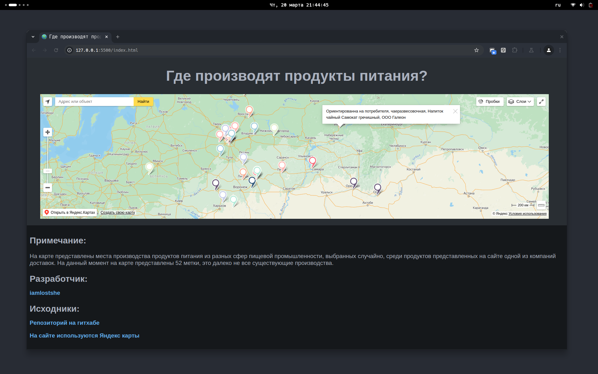

# Где производят разные продукты (карта)

## Мотивация

Проект был написан на урок географии, для того что-бы получить хорошую оценку)

И самое главное подтянуть свои навыки в новых (для меня) технологиях (см. раздел [Использованные технологии](https://github.com/iamlostshe/geography.github.io/#использованные-технологии))

## ТЗ

- [x] Написать сайт
- [x] Расположить на сайте информацию о продуктах питания и месте их изготовления
- [x] Опираясь на информацию на карте сделать вывод по какому признаку расположены производства различных продуктов питания в разных сферах

## Использованные технологии

1. HTML
2. CSS
3. JavaScript
4. API Яндекс Карт
